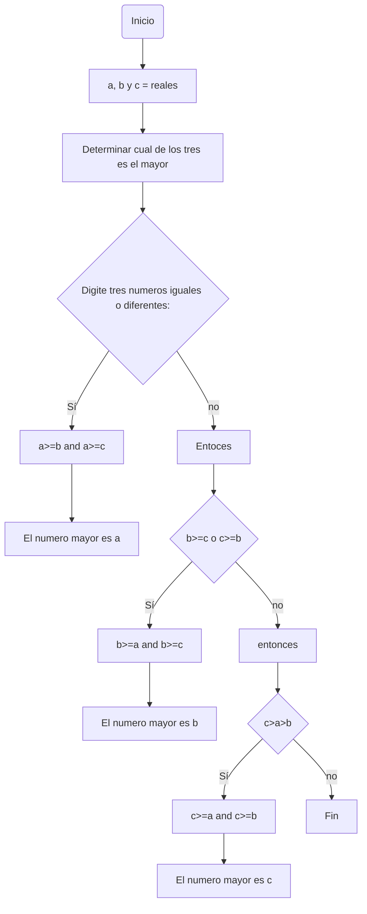
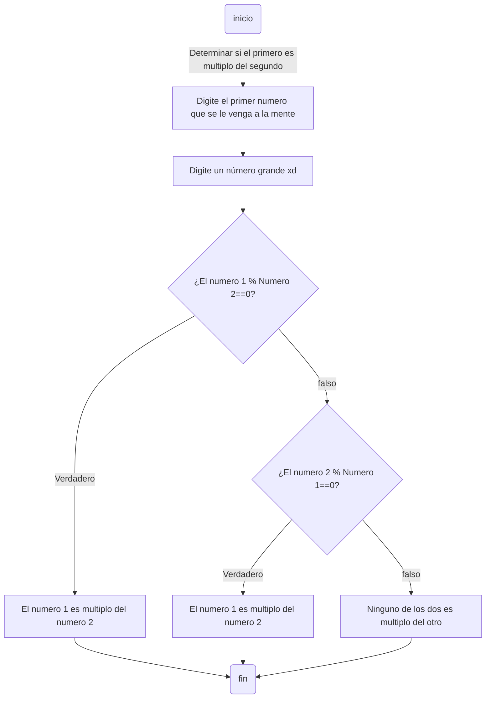
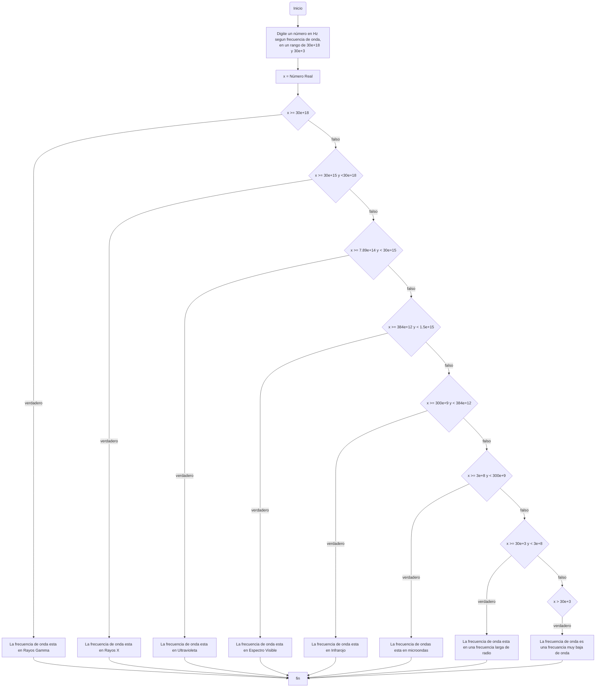

# Taller1_ProGreening
| Nombre                       | Identificación |      Grupo      |      Carrera        |
|------------------------------|----------------|-----------------|---------------------|
| Brayan Andres Guerrero Cortés| 1011201494     |                 |                     |
| Juan David Uribe Vélez       | 1011087091     |   ProGreening   | Ingeniería Agrícola |
| Pablo Mendoza Malagón        | 1072645448     |                 |                     |

<table cellspacing="1" bgcolor="" align="center">
  <tr bgcolor="#252582">
    <th><b>Taller 1 - Punto 1</b></th>
  </tr>
  <tr bgcolor="#e4e4ed">
    <td style="color:#141414" align="center">Realice el quiz Python Beginner Quiz (20 preguntas) y adjunte pantallazo con el resultado (mínimo 90% bien).</td>
  </tr>
</table>

[](https://postimg.cc/Hj4XKP1F)

2. Realice un programa que lea tres números reales y determine cuál es el mayor.
```python
a = int(input("Digite un numero: "))
b = int(input("Digite un numero: "))
c = int(input("Digite un numero: "))

if a>=b and a>=c:
    print(f"El numero mayor es {a}")
elif b>=a and b>=c:
    print(f"El numero mayor es {b}")
elif c>=a and c>=b:
    print(f"El numero mayor es {c}")
```
Último dígito de la cédula de Juan Uribe: 1, al ser el quiz, realizamos el diagrama de flujo del punto 2

3. Realice un programa que lea un número enteros y determine si es par o impar.
```python
a = int(input("Digite un numero: "))
b = int(input("Digite otro numero: "))

if a%2==0 and b%2==0:
    print("Ambos numeros son pares")
elif a%2==0 and b%2!=0:
    print(f"{a} es par")
elif a%2!=0 and b%2==0:
    print(f"{b} es par")
else:
    print("Ambos numeros son impares")
```
4. Realice un programa que lea dos números reales y determine si el primero es múltiplo del segundo.
```python
num1=int(input("ingresa un numero real 1\n"))
num2=int(input("ingresa un numero real 2\n"))
if num1 % num2 == 0 :
   print("el numero 1 es multiplo del numero 2")
elif num2 % num1 == 0:
 print("el numero 2 es multiplo del numero 1")  
else:
  print("niguno de los dos numeros el multiplo del otro numero")
```
Último dígito de la cédula de Brayan Guerrero: 4

5. Realice un programa que lea tres números reales y determine si la suma de los dos primeros es mayor, menor o igual que el tercer número.
```python
a=float(input("Digite un primer número\n" ))
b=float(input("Digite un segundo numero\n"))
c=float(input("Digite un ultimo numero\n"))
if a+b > c:
    print("El resultado de "+str(a)+" mas "+str(b)+" es mayor que "+str(c) )
elif a+b < c:
    print("El resultado de "+str(a)+" mas "+str(b)+" es menor que "+str(c) )
else:
    print("El resultado de "+str(a)+" mas "+str(b)+" es menor que "+str(c) )
```
6. Escriba un programa que solicite al usuario una letra y determine si es una vocal o una consonante.
```python
def una_vocal(letra):
  #def_define una nueva variable
  return letra.lower() in ["a","e","i","o","u"]
  # []es una  lista  a la cula podemos accerder cuando necesitamos
  # return_indica el final de la función y continúa la ejecución del programa tras la llamada a la función y el lower me indica que este en minuscula 
  #ademas el in devuelve True si un elemento se encuentra dentro de otro
letra = input('Ingresa una letra por favor: ')
if una_vocal(letra):
  print("Es  una vocal")
else:
  print("Es una consonante")
```
7. Escriba un programa que pida 5 números reales y calcule las siguientes operaciones:El promedio, la mediana, el promedio multiplicativo (multilplica todos y luego calcula la raíz de la cantidad de operandos), ordenar los números de forma ascendente, ordenar los números de forma descendente, la potencia del mayor número elevado al menor número y la raíz cúbica del menor número.
```python
a=float(input("Piense en un numero y digitelo: \n"))
b=float(input("Digite un numero completo y seguido del dia, mes y año de su nacimiento\nejemplo, dia 19 mes 10 año 2005, numero resultante 19102005: \n"))
c=float(input("Digite su edad sumando el año en el que estamos: \n"))
d=float(input("digite un numero re random: \n"))
e=float(input("Preguntele a su amigo un numero mayor a 500 y escribalo: \n"))

promedio : float = (a+b+c+d+e)/5
print("El promedio de los numeros es: ", promedio)

if a > b:
    a, b = b, a
if a > c:
    a, c = c, a
if a > d:
    a, d = d, a
if a > e:
    a, e = e, a
if b > c:
    b, c = c, b
if b > d:
    b, d = d, b
if b > e:
    b, e = e, b
if c > d:
    c, d = d, c
if c > e:
    c, e = e, c
if d > e:
    d, e = e, d

print("La mediana del conjunto es ", c)


promediomultiplicativo = a*b*c*d*e**(1/5)
print("El promedio multiplicativo es ", promediomultiplicativo)

potencia: float = e**a
print("potencia del mayor número elevando el menor número es: ",potencia)

print("La lista en orden ascendente es: ",a,b,c,d,e)
print("La lista en orden descendente es: ",e,d,c,b,a)

raiz = a**(1/3)
print("La raiz cubica del menor es: ", raiz)
```
8. Escriba un programa al que se le ingrese la frecuencia de una onda en hz y como salida arroje en que parte del espectro electromagnético se encuentra.
```python
x = float(input("Digite un numero en Hz segun la frecuencia de onda entre 30e+18 y 30e+3: "))
if x >= 30e+18:
    print("La frecuencia de onda esta en Rayos Gamma")
elif x >= 30e+15 and x < 30e+18:
    print("La frecuencia de onda esta en Rayos X")
elif x >= 7.89e+14 and x < 30e+15:
    print("La frecuencia de onda esta en Ultravioleta")
elif x >= 384e+12 and x < 1.5e+15:
    print("La frecuencia de onda esta en Espectro visible")
elif x >= 300e+9 and x < 384e+12:
    print("La frecuencia de onda esta en Infrarrojo")
elif x >= 3e+8 and x < 300e+9:
    print("La frecuencia de onda esta en Microondas")
elif x >= 30e+3 and x < 3e+8:
    print("La frecuencia de onda esta en Onda larga de radio")
elif x < 30e+3:
    print("La frecuencia de onda esta en Muy baja frecuencia de radio")
```
Último dígito de la cédula de Pablo Mendoza: 8



9. Escriba un programa que reciba el nombre en minúsculas de un país de America y retorne la ciudad capital, si el país no pertenece al continente debe arrojar país no identificado.
```python
def un_pais_america(pais):
    return pais.lower() in ["argentina","bolivia","brasil","chile","colombia","costa rica","cuba","ecuador","el salvador","guatemala","haiti","honduras","mexico","nicaragua","panama","paraguay","peru","republica dominicana","uruguay","venezuela","guayana francesa","puerto rico"]
pais = input('Ingresa una un pais de america latina : ')
if pais == "argentina":
 print("buenos aires")
elif pais == "bolivia" : 
 print("la paz")
elif pais == "brasil":
   print("brasilia")
elif pais == "chile" :
 print("santiago de chile")
elif pais== "colombia":
   print("bogota")
elif pais=="costa rica":
   print("san jose")
elif pais=="cuba":
   print("la habana")
elif pais == "ecuador":
   print("quito")
elif pais=="el salvador":
   print("san salvador")
elif pais=="guatemala":
 print("ciudad de guatemala")
elif pais== "haiti":
   print("puerto principe")
elif pais=="honduras":
 print("Tegucigalpa")
elif pais== "mexico":
  print("ciudad de mexico")
elif pais=="nicaruaga":
  print("managua")
elif pais=="panama":
   print("panama")
elif pais=="paraguay":
  print("asuncion")
elif pais=="peru":
  print("lima")
elif pais=="republica dominicana":
  print("santo Domingo")
elif pais=="uruguay":
  print("montevideo")
elif pais=="venezuela":
  print("caracas")
elif pais=="guyana francesa":
  print("cayena")
elif pais=="puerto rico":
 print("san juan")
else :
  print("pais no identificado ")
```
10. Escriba un programa que dada una distancia calcule: El tiempo que le tomaría a la luz recorrer la distancia, el tiempo que le tomaría al sonido (en el aire) recorrer la distancia, el tiempo que le tomaría al vehiculo comercial más veloz recorrer la distancia y el tiempo que le tomaría a Bolt recorrer la distancia.
```python
distancia = float(input("Digite una distancia en metros: "))
tiempoLuz = float = distancia/3.0e+8
print(f"El tiempo que tarda la luz en recorrer {distancia} en metros es de: {tiempoLuz} segundos.")
tiempoAire = float = distancia/349
print(f"El tiempo que tarda el sonido en recorrer {distancia} en metros con una temperatura de 30°C es de: {tiempoAire} segundos.")
tiempoAuto = float = distancia/136.25
print(f"El tiempo que tarda el Bugatti Chiron en recorrer {distancia} en metros es de: {tiempoAuto} segundos.")
tiempoUsainBolt = float = distancia/11.66
print(f"El tiempo que tarda Usain Bolt en recorrer {distancia} metros es de: {tiempoUsainBolt} segundos.")
``` 
<h2>Bibliografía</h2>
    <div class="bibliografia">
        <table>
            <tr>
                <th>Referencia</th>
            </tr>
          <tr>
                <td>Pythonspot. (2023). Python Tests / Quizes. Recuperado de https://pythonspot.com/python-tests-quizes/<a href="https://pythonspot.com/python-tests-quizes/"></a></td>
            </tr> 
          <tr>
                <td>Wikipedia. (2024). América Latina. Recuperado de (https://es.wikipedia.org/wiki/Am%C3%A9rica_Latina)<a href="(https://es.wikipedia.org/wiki/Am%C3%A9rica_Latina)"></a></td>
          </tr>
           <tr>
                <td>Programación ATS. (2019). Programación en Python. Recuperado de (https://www.youtube.com/playlist?list=PLWtYZ2ejMVJnh0KVllw24XklzJ62WNFsj)<a href="https://www.youtube.com/playlist?list=PLWtYZ2ejMVJnh0KVllw24XklzJ62WNFsj"></a></td>
          </tr>
          <tr>
                <td>Curso Interactivo de Física en Internet. Ángel Franco García. Recuperado de (http://www.sc.ehu.es/sbweb/fisica_/cuantica/experiencias/espectro/espectro.html)<a href="[https://concepto.de/espectro-electromagnetico/(http://www.sc.ehu.es/sbweb/fisica_/cuantica/experiencias/espectro/espectro.html)http://www.sc.ehu.es/sbweb/fisica_/cuantica/experiencias/espectro/espectro.html"></a></td>
          </tr>              
        </table>
    </div>
